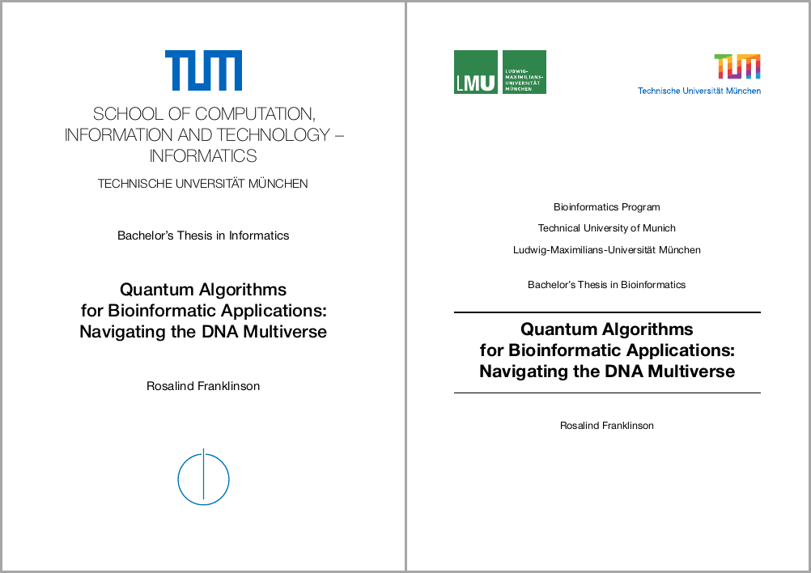
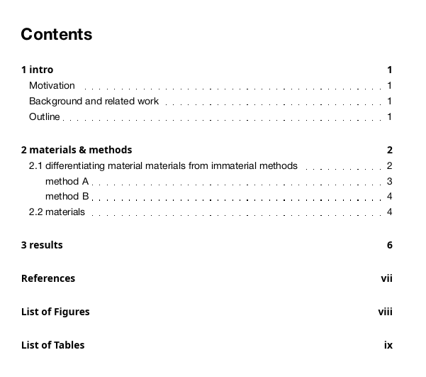
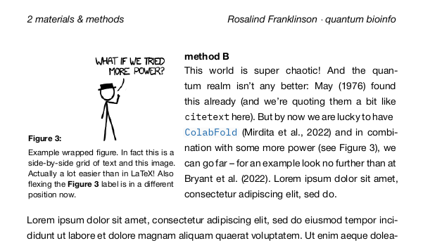
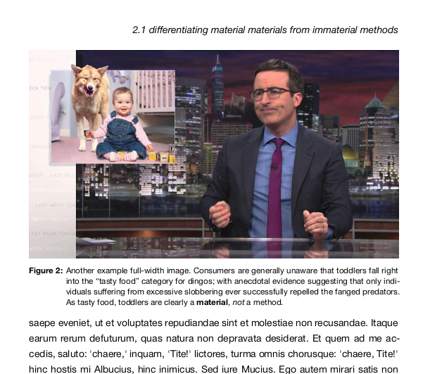
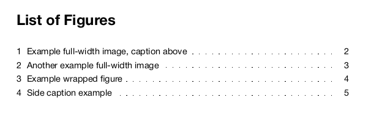

# typst-bioinfo-thesis
This is a [typst](https://typst.app/) thesis template with front matter for TUM+LMU [bioinformatics](https://www.cit.tum.de/cit/studium/studiengaenge/master-bioinformatik/abschlussarbeit/#c2494) and TUM [informatics](https://www.cit.tum.de/cit/studium/studierende/abschlussarbeit-abschluss/informatik/#c4295). Therefore, it generally supports English and German as main document languages. It comes with ready-to-use outlines, configurable page numbers adapting to front and back matter, as well as flexible headers that can imitate `scrbook`. I also implemented `sidecap` and a basic `wrapfig` equivalent. 

As of February 2025 and `typst 0.13.0 (d6b0d68f)`, this template works and is somewhat under development. If you find a bug, please feel free to open an issue!

To get started, edit `main.typ` or make a new minimal `thesis.typ`:
```rs
#import "modules/template.typ": *

#show: doc.with(
  title: [all beginnings are hard], 
  name: [silly old me])

= introduction
...
```

---

The TUM informatics and bioinformatics cover pages:


Table of contents with numbering up to level 2 headings, well-aligned fill characters and roman page numbers for the appendix: 









Defining a figure title for the list-of-figures is now less hacky:
```rs
#figure(
  image("/images/dingos.jpg", width: 100%),
  caption: flex-caption(
    [Another example full-width image], 
    [. Consumers are generally unaware that ...]),
) <dingos>
``````

